# InDoubt Job Search App

InDoubt is the latest job search app designed specifically for software engineers and tech professionals. Create your user profile, and gain access to a a variety of features designed to facilitate your success in finding your dream job!

### InDoubt App Install/Run

1. Fork and clone into a directory of your choosing. (https://github.com/iona-b/ruby-project-guidelines-sfo01-seng-ft-060120)
2. Navigate to the directory for the job search application. (cd ruby-project-guidelines-sfo01-seng-ft-060120)
3. Enter the command "bundle install" in the terminal.
4. Enter the command "ruby bin/run.rb" in the terminal.

 

### As an InDoubt app user you can:

1. Choose to log in or...
2. Create a personalized user profile to begin your job search.
3. Select what you'd like to do from our interactive menu.
4. View your user profile.
5. Update your user profile as soon as you have any changes.
6. Search for jobs that specifically match your profile and preferences.
7. Apply for jobs that you're interested in.
8. See all the jobs that you've applied for.
9. Delete one or all of your job applications.
10. Delete your user profile.
11. View Job Statistics

 

### Guide to Using the InDoubt App

#### 1. Log In or...

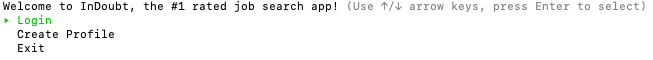

 

#### 2. Create Your User Profile

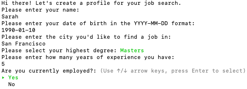

 

#### 3. Select What You'd Like to Do From Our Interactive Menu:

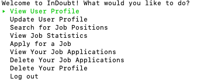

 

#### 4. View Your User Profile

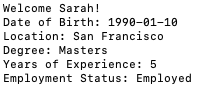

 

#### 5. Update Your User Profile

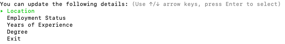

 

#### 6. Search For Job Positions

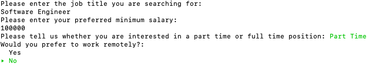

 

#### 7. Apply For A Job

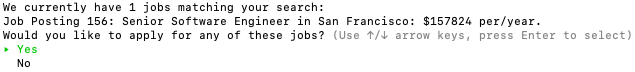 
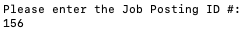

 

#### 8. View Your Open Job Applications

 

#### 9. Delete One or All of Your Job Applications

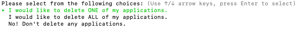

 

#### 10. Delete Your User Profile

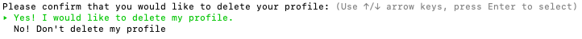

 

#### 11. View Job Statistics

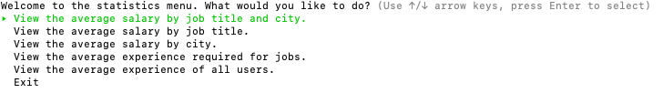  
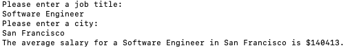

